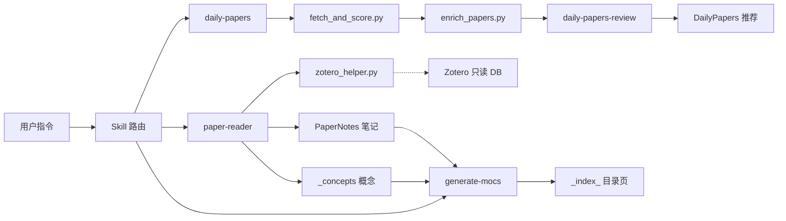
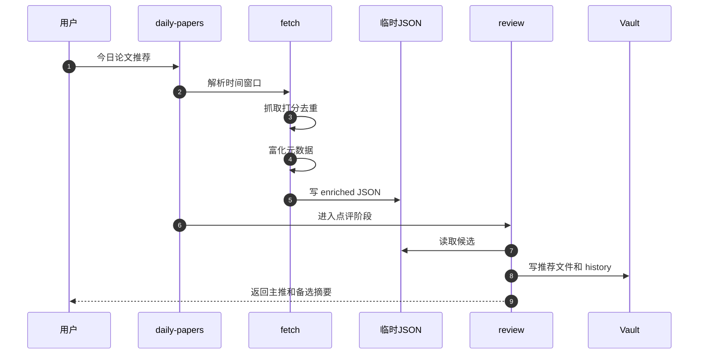

# Architecture

`dailypaper-skills` 不是常驻服务，而是一组 Codex skills + Python helper scripts。Codex 负责理解用户意图、写推荐和长笔记；Python 负责确定性抓取、去重、路径规划、Zotero 读取、MOC 生成和检查。

这份文件是仓库里的 canonical 架构文档。Obsidian 中的同名使用指南应当是它的 hard link，方便在 Obsidian 里阅读和编辑同一份文件。

## 一句话理解

用户说一句自然语言，系统把它路由到对应 skill：

- `今日论文推荐`：抓取候选论文，富化信息，生成每日推荐。
- `读一下这篇论文 ...`：读取 PDF / arXiv / Zotero，按模板生成 Obsidian 论文笔记。
- `批量读 Zotero collection ...`：按 Zotero collection 递归处理论文，保存到同构目录。
- `更新索引`：刷新论文和概念目录页。

核心原则：

- 论文目录由 Zotero collection path 决定，不靠关键词猜分类。
- 概念目录由 `concept_type` 决定，不按论文研究领域分类。
- Zotero 默认只读；写 Zotero collection 只能在用户明确要求后执行。
- 每日推荐默认只做 fetch + review，不自动精读生成长笔记。

## 核心心智模型

| 概念 | 位置 | 作用 |
|---|---|---|
| Skill | `skills/*/SKILL.md` | 用户意图到具体流程的入口说明 |
| 三步流水线 | `daily-papers-fetch` → `daily-papers-review` → `daily-papers-notes` | 抓取、点评、可选精读 |
| `paper-reader` | `skills/paper-reader/SKILL.md` | 单篇 / 批量论文阅读和笔记生成 |
| `_shared` 配置 | `skills/_shared/user_config.py` | 统一读取 Obsidian、Zotero、关键词和自动化配置 |
| Zotero helper | `skills/paper-reader/assets/zotero_helper.py` | 解析 item、collection、PDF、保存路径和已有笔记 |
| MOC | `skills/_shared/generate_*_mocs.py` | 递归生成 `_index_*.md` 目录页 |

## 总体流程



## 组件职责

| 组件 | 关键文件 | 职责 |
|---|---|---|
| `daily-papers` | `skills/daily-papers/SKILL.md` | 一句话推荐入口，默认串 fetch + review |
| `daily-papers-fetch` | `skills/daily-papers-fetch/SKILL.md` | 运行抓取、打分、富化脚本 |
| `fetch_and_score.py` | `skills/daily-papers/fetch_and_score.py` | DBLP / program / arXiv / Semantic Scholar 抓取、打分、去重、配额 |
| `enrich_papers.py` | `skills/daily-papers/enrich_papers.py` | 补全作者、机构、摘要、图表、方法名和点评信号 |
| `daily-papers-review` | `skills/daily-papers-review/SKILL.md` | 生成主推 / 备选 / 可跳过推荐文件 |
| `daily-papers-notes` | `skills/daily-papers-notes/SKILL.md` | 可选批量精读，调用 `paper-reader` 并回填笔记链接 |
| `paper-reader` | `skills/paper-reader/SKILL.md` | 单篇论文阅读、概念补全、Obsidian 保存 |
| `paper_daemon.py` | `skills/paper-reader/paper_daemon.py` | Zotero collection 批量处理和断点续跑 |
| `zotero_helper.py` | `skills/paper-reader/assets/zotero_helper.py` | 只读解析 Zotero、规划 note path、索引已有笔记 |
| `generate-mocs` | `skills/generate-mocs/SKILL.md` | 手动刷新论文和概念 MOC |
| `_shared` | `skills/_shared/` | 配置、MOC builder、missing concept scanner |

## 关键数据与路径

```text
PaperRead/
├── DailyPapers/
│   ├── YYYY-MM-DD-论文推荐.md
│   └── .history.json
└── PaperNotes/
    ├── Research Topics/.../{MethodName}.md
    ├── _concepts/{concept_type}/{ConceptName}.md
    ├── _inbox/{MethodName}.md
    └── _index_*.md
```

| 数据 | 生产者 | 消费者 |
|---|---|---|
| `/tmp/daily_papers_top30.json` | `fetch_and_score.py` | `enrich_papers.py` |
| `/tmp/daily_papers_enriched.json` | `enrich_papers.py` | `daily-papers-review`、`daily-papers-notes` |
| `DailyPapers/.history.json` | `daily-papers-review` | `fetch_and_score.py` history dedup |
| Paper note frontmatter | `paper-reader` | `zotero_helper.py` `NoteIndex` |
| Concept files | `paper-reader` / manual maintenance | concept MOC、missing concept scan |

## 每日推荐流水线



### 抓取与打分

`fetch_and_score.py` 负责候选生成：

- 来源：DBLP proceedings / journal pages、会议 program pages、arXiv API、Semantic Scholar fallback。
- arXiv 默认分类：`cs.AR`、`cs.DC`、`cs.NI`、`cs.OS`、`cs.PL`、`cs.AI`、`cs.LG`。
- venue 关注：ISCA、MICRO、HPCA、ASPLOS、SIGCOMM、NSDI、OSDI、USENIX ATC、EuroSys、SC、MLSys。
- DBLP conference 只有年份时，用 `VENUE_MONTH_HINTS` 生成典型月份日期，例如 MICRO→10、ISCA→6、ASPLOS→4；journal 日期不套用会议月份。

打分核心：

| 信号 | 行为 |
|---|---|
| `keywords` 命中标题 | 每个 +3 |
| `keywords` 命中摘要 | 每个 +1 |
| `domain_boost_keywords` 命中 | 阶梯加分 |
| 已知 venue / systems phrase | 加分 |
| `negative_keywords` 命中标题 | 直接 `-999` 硬排除 |
| `negative_keywords` 只命中摘要 | 不硬排除 |

去重和排序：

- `paper_lookup_keys()` 同时生成 arXiv、DOI、规范化标题 key。
- `dedup_key()` 用 arXiv > DOI > title 做内存合并。
- `build_history_index()` 兼容旧 history 中 title、DOI、arXiv URL 混杂的 `id`。
- 单日模式使用 `.history.json` 做历史去重；候选不足时允许回填历史命中论文并标记 `is_re_recommend`。
- `apply_age_decay()` 降低旧会议论文分数，避免 DBLP back-catalog 挤掉当天 arXiv。
- `select_with_quota()` 限制非 arXiv 来源占比，默认 DBLP / venue 来源最多占 `top_n * 40%`。

### 富化与点评

`enrich_papers.py` 并发补全：

- arXiv / DOI / Semantic Scholar / OpenAlex 元数据。
- 作者、机构、章节标题、图表 caption、首图。
- `method_name`、`method_names`。
- `has_hardware_eval`、`has_end_to_end_eval`、`has_real_workload` 等信号。

`daily-papers-review` 只基于已有证据写推荐：

- `has_hardware_eval=false` 的论文默认不进主推。
- serving 论文若缺 end-to-end evaluation，最多进备选。
- 不确定信息写“摘要未提及”或“需要看全文确认”。

## Paper Reader

支持输入：

| 输入 | 处理 |
|---|---|
| 本地 PDF | 直接读取 |
| arXiv 链接 | 优先 arXiv HTML，再 PDF |
| DOI / Paper URL | WebFetch / WebSearch fallback |
| Zotero item | `zotero_helper.py resolve --item-id` |
| Zotero 搜索 | `zotero_helper.py resolve --query`，多候选时让用户选 |
| Zotero collection | `zotero_helper.py resolve --collection --recursive` |

保存规则：

- 文件名使用主方法名 / 系统名：`{MethodName}.md`。
- 有 Zotero collection 时保存到 `{PaperNotes}/{collection_path}/{MethodName}.md`。
- 无 collection 时保存到 `{PaperNotes}/_inbox/{MethodName}.md`。
- frontmatter 写入 `zotero_item_id`、`zotero_collection`、`doi`、`arxiv_id`。
- 批量模式默认跳过已有笔记，不重新分类或误移动。

唯一论文笔记模板：

```text
skills/paper-reader/assets/paper-note-template.md
```

模板重点是 systems 论文，而不是模型能力摘要：瓶颈、优化对象、工作负载、系统假设、关键机制、实验设置、核心结果、overhead、复现和可迁移启示。

## Zotero 与笔记去重

`zotero_helper.py` 的默认路径是只读：

- 读取前复制 `zotero.sqlite` 到唯一临时文件。
- SQLite 连接设置 `PRAGMA query_only = ON`。
- 关闭连接时删除临时库。
- `move`、`add-to-collection`、`remove-from-collection` 属于显式写命令，不能自动调用。

`resolve` 是新入口：

```bash
python3 skills/paper-reader/assets/zotero_helper.py resolve --item-id 2487
python3 skills/paper-reader/assets/zotero_helper.py resolve --query "vLLM"
python3 skills/paper-reader/assets/zotero_helper.py resolve --collection "Research Topics/..." --recursive
```

兼容期旧命令 `papers`、`search`、`info`、`find-collection` 仍可用，但会打印 deprecation warning；新文档和脚本应使用 `resolve` / `note-path`。

已有笔记匹配由 `NoteIndex` 完成，优先级：

1. `zotero_item_id`
2. `doi`
3. `arxiv_id`
4. 规范化 title
5. method name / 文件名兜底

`_inbox` 会纳入索引；`_concepts` 和 `_index_*.md` 会排除。多个笔记共享同一精确 ID 时返回 conflict，不静默选择。

## 概念库与 MOC

概念分类单一信源：

```text
skills/paper-reader/references/concept-categories.md
```

8 个 `concept_type`：

| concept_type | 含义 |
|---|---|
| `data-structure` | 数据格式、表示、结构 |
| `algorithm` | 脱离具体系统也成立的计算逻辑 |
| `mechanism` | 绑定系统上下文的运行时策略 |
| `architecture` | 宏观系统架构、服务模式 |
| `hardware` | 硬件部件、计算单元、物理互联 |
| `software-abstraction` | OS、框架层接口与协议 |
| `metric` | 评估指标、测量口径 |
| `theory-model` | 性能数学模型、统计基础 |

paper-method 不是正式 `concept_type`。如果是论文首创且只在本论文实验，落到最接近类型并加 `tags: [status/paper-specific]`；如果被多篇作为 baseline 或通用实现，再升格为普通 concept。

Missing concept scan：

```bash
python3 skills/_shared/scan_missing_concepts.py --dry-run
python3 skills/_shared/scan_missing_concepts.py --with-seed --output /tmp/missing_concepts.csv
```

扫描器排除 `_concepts/`、`_inbox/`、`_index_*.md`，并排除论文笔记之间的互链，避免把论文标题误报成概念。

MOC 入口：

```bash
python3 skills/_shared/generate_concept_mocs.py
python3 skills/_shared/generate_paper_mocs.py
```

MOC 文件名前缀来自 `mocs.filename_prefix`，当前推荐 `_index_`。内容不变时不重写，保持幂等。

## 配置与自动化开关

配置加载顺序：

1. `skills/_shared/user_config.py` 内置 `DEFAULT_CONFIG`
2. `skills/_shared/user-config.json`
3. `skills/_shared/user-config.local.json`

| 配置组 | 说明 |
|---|---|
| `paths.*` | Obsidian vault、论文笔记目录、每日推荐目录、概念目录、Zotero DB / storage |
| `daily_papers.keywords` | 主关键词 |
| `daily_papers.negative_keywords` | 标题硬排除关键词 |
| `daily_papers.domain_boost_keywords` | systems 相关性加分词 |
| `daily_papers.arxiv_categories` / `min_score` / `top_n` | 抓取分类、阈值、候选上限 |
| `automation.auto_refresh_indexes` | 生成笔记后是否刷新 MOC |
| `automation.git_commit` | 是否自动 commit vault |
| `automation.git_push` | 是否自动 push；只有 `git_commit=true` 时才生效 |
| `mocs.filename_prefix` | MOC 文件名前缀 |

`git_push` 会在 `user_config.py` 中被校验：如果 `git_commit=false`，即使配置了 push 也会被压成 false。

## 源码入口

| 想了解 | 优先看 |
|---|---|
| 用户入口 | `skills/daily-papers/SKILL.md`、`skills/paper-reader/SKILL.md`、`skills/generate-mocs/SKILL.md` |
| 抓取打分 | `skills/daily-papers/fetch_and_score.py` |
| 元数据富化 | `skills/daily-papers/enrich_papers.py`、`parse_arxiv.py`、`extract_affiliations.py` |
| 推荐生成 | `skills/daily-papers-review/SKILL.md` |
| 批量笔记 | `skills/daily-papers-notes/SKILL.md` |
| Zotero 解析 | `skills/paper-reader/assets/zotero_helper.py` |
| Zotero 批量 | `skills/paper-reader/paper_daemon.py` |
| 论文模板 | `skills/paper-reader/assets/paper-note-template.md` |
| 概念分类 | `skills/paper-reader/references/concept-categories.md` |
| 配置加载 | `skills/_shared/user_config.py` |
| MOC 生成 | `skills/_shared/moc_builder.py`、`generate_concept_mocs.py`、`generate_paper_mocs.py` |
| 测试 | `tests/test_fetch_and_score.py`、`tests/test_zotero_helper.py`、`tests/test_scan_missing_concepts.py`、`tests/test_paper_daemon.py` |

## 排错与验证

| 现象 | 优先检查 |
|---|---|
| 推荐为空 | `keywords`、`min_score` 是否太严；标题负词是否误伤 |
| 老论文反复推荐 | `.history.json` 是否能被 `paper_lookup_keys()` 还原成同一 key |
| 推荐里旧会议论文过多 | `date` 是否缺失导致 `apply_age_decay()` 未生效；非 arXiv 配额是否过高 |
| Zotero 找不到论文 | 先用 `resolve --item-id` 或 `resolve --query` 看元数据和 PDF 路径 |
| 单篇命中多个 collection | 必须让用户选择 `selected_collection_path` |
| 批量保存到父目录 | 检查是否使用 `source_collection_path`，而不是父 collection |
| 目录页没更新 | 手动运行 `generate_concept_mocs.py` 和 `generate_paper_mocs.py` |
| 概念缺失 | 运行 `scan_missing_concepts.py --dry-run`，按模板补齐 |
| 跑完没 commit | 默认 `automation.git_commit=false` |

推荐开发验证：

```bash
pytest tests/
git diff --check
```

## Obsidian Hard Link

目标 Obsidian 路径：

```text
/Users/bytedance/Library/Mobile Documents/iCloud~md~obsidian/Documents/ob-career/002-notes/001 使用指南/dailypaper-skills-架构和使用文档.md
```

该路径应当 hard link 到本文件：

```text
/Users/bytedance/Tools/dailypaper-skills/ARCHITECTURE.md
```

检查命令：

```bash
stat -f "%d %i %l %N" /Users/bytedance/Tools/dailypaper-skills/ARCHITECTURE.md \
  "/Users/bytedance/Library/Mobile Documents/iCloud~md~obsidian/Documents/ob-career/002-notes/001 使用指南/dailypaper-skills-架构和使用文档.md"
```

两行的 device 和 inode 必须一致，link count 应至少为 2。

注意：iCloud sync、`git checkout`、`git restore`、rebase 或某些编辑器的“写新文件再替换”行为可能打断 hard link。如果 inode 不再一致，重新备份 Obsidian 文件后删除该路径，再用 `ln ARCHITECTURE.md <Obsidian path>` 重建。
