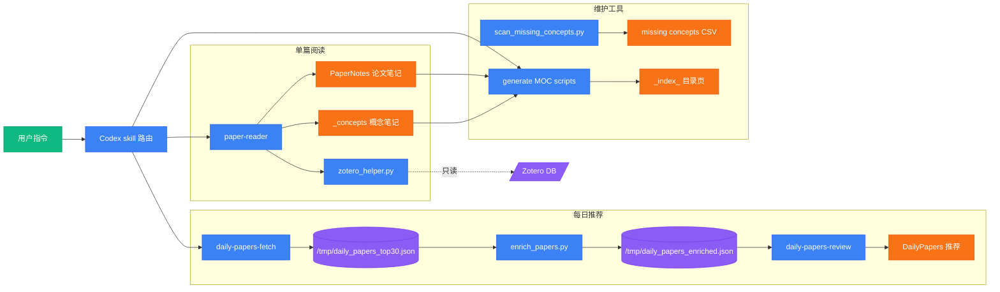

# Architecture

本文档说明 `dailypaper-skills` 当前实现：它不是一个常驻服务，而是一组 Codex skills + Python helper scripts。Codex 负责理解用户意图和写长文档；Python 脚本负责确定性抓取、去重、路径规划、索引生成和质量检查。

## 总览



主入口：

| 用户意图 | Skill | 结果 |
|---|---|---|
| 今日论文推荐 | `daily-papers` | 抓取 + 点评，写入 `DailyPapers/` |
| 跑单步抓取 | `daily-papers-fetch` | 写 `/tmp/daily_papers_top30.json` 和 `/tmp/daily_papers_enriched.json` |
| 跑单步点评 | `daily-papers-review` | 写每日推荐文件并更新 `.history.json` |
| 批量精读 | `daily-papers-notes` | 调 `paper-reader` 生成必读论文笔记并回填链接 |
| 读单篇论文 | `paper-reader` | 写论文笔记、补概念库、刷新 MOC |
| 更新索引 | `generate-mocs` | 生成 `_index_*.md` 目录页 |

## 配置层

配置集中在 `skills/_shared/user_config.py`：

1. 读取内置 `DEFAULT_CONFIG`
2. 合并 `skills/_shared/user-config.json`
3. 如存在，再合并 `skills/_shared/user-config.local.json`

对外提供：

| 函数 | 用途 |
|---|---|
| `obsidian_vault_path()` | Obsidian vault 根目录 |
| `paper_notes_dir()` | 论文笔记目录 |
| `daily_papers_dir()` | 每日推荐目录 |
| `concepts_dir()` | 概念库目录 |
| `zotero_db_path()` | Zotero SQLite DB |
| `zotero_storage_dir()` | Zotero 附件目录 |
| `daily_papers_config()` | 抓取关键词、负词、阈值 |
| `automation_config()` | MOC / git 自动化开关 |
| `moc_filename_prefix()` | MOC 文件名前缀 |

`git_push` 只有在 `git_commit=true` 时才可能为真，避免误 push。

## 每日推荐流水线

### Step 1: `fetch_and_score.py`

位置：`skills/daily-papers/fetch_and_score.py`

职责：

- 抓取 DBLP proceedings / journal pages。
- 抓取最近会议 program pages。
- 抓取 arXiv API：`cs.AR / cs.DC / cs.NI / cs.OS / cs.PL / cs.AI / cs.LG`。
- 候选不足时补 Semantic Scholar。
- 用配置中的 keywords / negative keywords / domain boost keywords 打分。
- 用 arXiv ID、DOI、标题做合并去重。
- 单日模式下用 `DailyPapers/.history.json` 做 30 天去重；候选不足时可从历史回补并标记 `is_re_recommend`。
- 控制 DBLP / venue 来源比例，避免旧会议目录挤掉当日 arXiv。

输出：

```text
/tmp/daily_papers_top30.json
```

重要边界：

- `fetch_url()` 对 `429 / 5xx` 做有限重试，支持 `Retry-After`。
- `negative_keywords` 是强过滤，命中直接排除。
- 多天模式不走历史去重，适合回看一周候选。

### Step 2: `enrich_papers.py`

位置：`skills/daily-papers/enrich_papers.py`

职责：

- 并发富化候选论文元数据。
- 通过 arXiv title search、DOI metadata、DOI landing page、Semantic Scholar、OpenAlex 等途径补齐链接和摘要。
- 从 arXiv HTML / abs 页面提取作者、机构、章节标题、图表 caption、首图。
- 对 PDF affiliation 提取使用可注入 / 可 mock 的 PDF bytes fetch 层，再交给 `pdftotext` 转文本，避免单测访问真实网络。
- 推断 `method_name` / `method_names`。
- 标记 `has_hardware_eval`、`has_end_to_end_eval`、`has_real_workload` 等点评信号。

输出：

```text
/tmp/daily_papers_enriched.json
```

### Step 3: `daily-papers-review`

这是 Codex 生成推荐文字的阶段。输入是 `/tmp/daily_papers_enriched.json`。

职责：

- 扫描已有论文笔记，避免重复推荐时误认为新论文。
- 使用 `source` 字段区分 DBLP、conference program、arXiv、Semantic Scholar。
- 只围绕 LLM inference / serving / training 的体系结构、网络通信、内存 / 存储问题写推荐。
- 分为 `主推`、`备选`、`可跳过`。
- 保存 `{DAILY_PAPERS_PATH}/YYYY-MM-DD-论文推荐.md`。
- 更新 `{DAILY_PAPERS_PATH}/.history.json`。

硬约束：

- `has_hardware_eval=false` 的论文默认不进主推。
- serving 论文如果 `has_end_to_end_eval=false`，最多进备选。
- 不确定信息写“摘要未提及”或“需要看全文确认”。

### Step 4: `daily-papers-notes`（可选）

默认每日推荐不自动执行此阶段。用户显式要求“跑一下论文笔记 / 批量笔记”时才执行。

职责：

- 读取当天推荐文件，筛选主推论文。
- 检查已有笔记质量：行数、必要章节、公式、图片。
- 不合格笔记删除后重新调用 `paper-reader`。
- 回填 `📒 **笔记**: [[NoteName]]` 到推荐文件。
- 按配置刷新 MOC。

## `paper-reader`

位置：`skills/paper-reader/SKILL.md` 和 `skills/paper-reader/paper_daemon.py`

### 输入类型

| 输入 | 处理 |
|---|---|
| 本地 PDF | 直接读取 PDF |
| arXiv 链接 | 优先 arXiv HTML，再 PDF |
| DOI / Paper URL | WebFetch / WebSearch fallback |
| Zotero item | `zotero_helper.py resolve --item-id` |
| Zotero 搜索 | `zotero_helper.py resolve --query` |
| Zotero collection | `zotero_helper.py resolve --collection --recursive` |

### 笔记模板

单一模板源：

```text
skills/paper-reader/assets/paper-note-template.md
```

模板针对 systems / architecture 论文优化，包含：

- 元信息
- 一句话总结
- 作者核心 insights
- 问题定义与瓶颈
- 动机实验 / characterization
- 系统设计总览
- Mermaid 系统架构与执行流
- 优化目标与度量口径
- 系统组成与职责
- 条件化实现改动清单
- 关键机制拆解
- 实验设置与核心结果
- Overhead 与兼容性
- 批判性思考
- 经验与可迁移启示
- 复现
- 关联笔记
- 速查卡片

模板要求公式和图表嵌入叙事位置，不再单独生成“关键公式 / 关键图表”章节。

### Zotero 只读集成

位置：`skills/paper-reader/assets/zotero_helper.py`

关键设计：

- 读取 Zotero 前先复制 `zotero.sqlite` 到唯一临时文件。
- 连接上执行 `PRAGMA query_only = ON`。
- 关闭连接时删除临时库。
- 默认不修改 Zotero collection。
- 如果分类不合理，只在笔记或回复里提出建议，用户确认后才允许调用写命令。

collection 解析：

- item 可属于多个 collection。
- 单篇模式中如果有多个 path，需要用户选择本次保存的 `selected_collection_path`。
- 批量递归 collection 时，使用 item 在该 subtree 下最具体的 child collection 作为 `source_collection_path`。

保存路径：

```text
{NOTES_PATH}/{selected_collection_path}/{MethodName}.md
{NOTES_PATH}/_inbox/{MethodName}.md
```

路径段只做文件名安全清洗；frontmatter 中的 `zotero_collection` 写清洗后的路径，保证磁盘路径与元数据一致。

### 已有笔记匹配

`zotero_helper.py` 中的 `NoteIndex` 会扫描已有笔记，匹配优先级：

1. `zotero_item_id`
2. `doi`
3. `arxiv_id`
4. 规范化 title
5. method name / 文件名兜底

`_inbox` 会被纳入索引，`_concepts` 和 `_index_*.md` 会被排除。多个笔记共享同一个精确 ID 时返回 conflict，不静默选第一个。

保存规划由 `plan_note_save()` 决定：

- 无匹配：`create`
- 单篇同路径：`update`
- 单篇路径漂移：`move`
- 批量模式已有笔记：默认 `skip`

## 概念库

规则单一信源：

```text
skills/paper-reader/references/concept-categories.md
```

概念按 concept type 归类，而不是按研究领域归类：

| concept_type | 含义 |
|---|---|
| `data-structure` | 数据格式 / 表示 / 结构 |
| `algorithm` | 脱离系统也成立的计算逻辑 |
| `mechanism` | 绑定系统上下文的运行时策略 |
| `architecture` | 宏观系统架构 / 服务模式 |
| `hardware` | 硬件部件 / 计算单元 / 物理互联 |
| `software-abstraction` | OS / 框架层接口与协议 |
| `metric` | 评估指标 / 测量口径 |
| `theory-model` | 性能数学模型 / 统计基础 |

paper-method 不作为正式 `concept_type`。处理分三档：

| 情形 | 处理 |
|---|---|
| 论文首创且仅本论文实验 | 落到最接近 type，加 `tags: [status/paper-specific]` |
| 具名实现且被多篇作为 baseline / 前人工作 | 升格为通用 concept |
| 完全是前人工作且该论文只是引用 | 不独立建 concept |

### Seed vocabulary

`concept-categories.md` 中的 “Systems Concept Seed Vocabulary” 是触发词白名单。写论文笔记时，seed list 中的术语首次出现必须写成 `[[概念名]]`，即使作者把它当常识。

### 离线扫描

位置：`skills/_shared/scan_missing_concepts.py`

职责：

- 扫描 `PaperNotes/**/*.md` 中的 `[[wikilink]]`。
- 排除 `_concepts/`、`_inbox/`、`_index_*.md`。
- 读取已有 concept 文件名和 frontmatter aliases。
- 读取已有 paper note 文件名，避免把论文互链误报为 concept。
- 可选读取 seed vocabulary，输出“应该有但还没有 concept”的候选。

输出字段：

```text
concept_name, refs_count, example_papers, candidate_type
```

## MOC 目录页

共享引擎：`skills/_shared/moc_builder.py`

入口：

```text
skills/_shared/generate_concept_mocs.py
skills/_shared/generate_paper_mocs.py
```

行为：

- 递归扫描目录。
- 每个目录生成一个 MOC 文件。
- 默认文件名前缀来自 `mocs.filename_prefix`，当前配置推荐 `_index_`。
- 目录页包含子目录链接和当前目录笔记列表。
- 内容不变时不重写，保持幂等。
- 论文 MOC 排除 `_concepts` 和 `_inbox`。

## Obsidian vault 结构

当前推荐结构：

```text
PaperRead/
├── DailyPapers/
│   ├── 2026-05-15-论文推荐.md
│   └── .history.json
└── PaperNotes/
    ├── Research Topics/
    │   └── LLM Infrastructure/
    │       └── Benchmarks & Characterization/
    │           └── Towards Understanding, Analyzing, and Optimizing Agentic AI Execution - A CPU-Centric Perspective.md
    ├── _concepts/
    │   ├── data-structure/
    │   ├── algorithm/
    │   ├── mechanism/
    │   ├── architecture/
    │   ├── hardware/
    │   ├── software-abstraction/
    │   ├── metric/
    │   └── theory-model/
    ├── _inbox/
    └── _index_PaperNotes.md
```

论文目录由 Zotero collection path 决定；概念目录由 concept type 决定。两套分类独立，通过 Obsidian wikilink 连接。

## 测试覆盖

主要测试：

| 文件 | 覆盖 |
|---|---|
| `tests/test_fetch_and_score.py` | 抓取打分、历史去重、arXiv/DOI key、来源配额 |
| `tests/test_enrich_papers.py` | 元数据富化、arXiv title fallback、PDF affiliation mock |
| `tests/test_paper_daemon.py` | 批量处理、临时 Zotero DB 清理、保存路径规划 |
| `tests/test_zotero_helper.py` | Zotero collection path、NoteIndex、note save plan |
| `tests/test_scan_missing_concepts.py` | missing concept scan、seed vocabulary、论文互链排除 |
| `tests/test_systems_template.py` | 模板结构、systems 章节、概念规则、Zotero 工作流 |
| `tests/test_daily_papers_theme.py` | daily-papers 主题与默认流程 |

推荐验证：

```bash
pytest tests/
git diff --check
```
