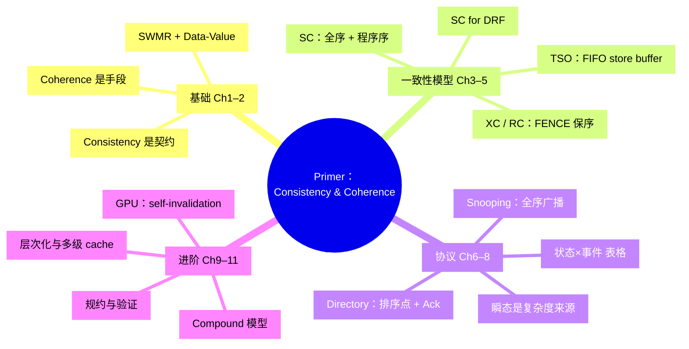

# 思维导图规则

读书笔记里的 `## 思维导图` 小节用 Mermaid `mindmap` 绘制，Obsidian 能直接渲染（mermaid-popup 插件支持弹窗缩放）。

“渲染 → 看图 → 重排”的闭环沿用 `~/.claude/skills/_shared/mermaid-rules.md` 的 §1。该文件 §2、§3 的检查项和排版规则是为 flowchart 写的（主流向、边语义、LR/TB），对 mindmap **不适用**。mindmap 的看图检查以本文件 §3 为准。

## 1. 内容结构

| 层级 | 放什么 | 数量 |
|---|---|---|
| root | 书名短称，必要时用 `<br/>` 断成 2 行 | 1 |
| 第 1 层 | 全书的**主题块**，标签写成 `主题名 ChX–Y` | 3–5 |
| 第 2 层 | 该块的核心结论或关键概念，一个节点只表达一个判断 | 每块 3–5 |
| 第 3 层 | 默认不用；只有某个论点不拆开就讲不清时才加 | 全图 ≤ 2 |

**节点预算：全图（含 root）目标 18–24 个，硬上限 26 个。** 实测数据：

- 22 个节点：清晰。
- 24–29 个节点：root 周围的连线被压在节点下面。
- 50 个节点：分支之间互相重叠。

如果内容放不下，就删节点，不要提高预算。块数和每块节点数要搭配着落进预算，常用组合：

- 3 块 × 5–6 个节点
- 4 块 × 4–5 个节点
- 5 块 × 3 个节点

**第 1 层怎么切：**

- 按全书的论证主线切。
- 章数 ≤ 5 且每章是一个独立主题时，可以一章一块。
- 相邻的短章节合并成一块，例如 `基础 Ch1–2`。
- 单章占全书笔记的 40% 以上时，可以按节拆成两块，写成 `主题名 Ch3.1–3.3`。
- 不要为了凑数把一章拆碎。

**标签冲突时的优先级：不重叠 > 结论型 > 字数。**

- 第 2 层写结论，不写话题。例如写 `TSO：FIFO store buffer`，而不是 `TSO 模型`。
- 标签长度：中文字数加上英文 token 数 × 2，合计不超过 14，并且渲染后要在一行内放得下。
  - 英文 token 指以空格分隔的英文词、数字、单位或缩写，每个算 1 个。
  - 例如 `32 B sector 对齐 GDDR5`：中文 2 字，英文 token 4 个，合计 2 + 4×2 = 10。
- 结论写不进 14 个单位时，删掉同块里次要的节点，留出空间。不要把结论缩成话题。

**来源和取舍：**

- 第 2 层的每个节点都必须能在 `## 章节要点` 里找到对应内容。导图不引入正文里没有的信息。
- 为满足预算而删掉的重要主题，要在导图下方的说明段里点名，并指回 `章节要点` 的对应小节。

## 2. 语法

- 非 root 节点一律写成 `ID["文本"]`：
  - ID 用有语义的英文，例如 `Models`、`M1`。
  - 文本放在双引号里，这样 `()`、`[]`、`：`、`&` 不会被解析成形状语法。
- root 写成 `root(("文本"))`，渲染为圆形中心。
- 缩进只用空格，每层 2 格。
  - 缩进错位会把节点挂到错误的父节点下，并且**不会报错**。
- 文本里不要出现双引号和反引号。
- 不上色，不加 `::icon()`。

## 3. 看图检查

1. 用 `-s 3` 渲染。整图分辨率太低，看不出 root 附近的遮挡，所以还要居中裁剪出 root 区域，放大检查：
   ```bash
   npx -y @mermaid-js/mermaid-cli -i mm.mmd -o mm.png -b white -s 3
   W=$(sips -g pixelWidth mm.png | awk '/pixelWidth/{print $2}')
   H=$(sips -g pixelHeight mm.png | awk '/pixelHeight/{print $2}')
   sips -c $((H*7/10)) $((W/2)) mm.png --out mm_center.png   # 居中裁剪宽 50%、高 70%
   ```
   力导向布局不保证 root 正好在中心。如果裁剪图里看不到 root 圆形，或者 root 的某条分支连线被裁掉了，就把裁剪尺寸放大到宽 70%、高 90% 重新裁剪。
2. **整图和中心裁剪图都要用 Read 打开看。** 只看整图会漏判。
3. 逐项检查：

| 检查项 | 不通过的表现 |
|---|---|
| 无遮挡 | 节点互相压住；root→分支的连线从某个节点下面穿过（**在中心裁剪图里查**） |
| 分支归属清楚 | 节点颜色和所属分支不一致，或者节点被甩到别的分支附近 |
| 文字完整 | 节点文字被截断，或折成多行 |
| 宽高比 | 整图宽:高 ≤ 约 2.5:1 |

4. 不通过就修，修法按优先级排列：
   - 删除次要节点；
   - 合并相近节点；
   - 合并第 1 层的分支（按 §1 从大章拆出的两块，可以合回一块）。

   两种情况的专门修法：
   - 文字被截断或折行：把该标签**缩短**，只删词不扩写。缩短后仍然写不下结论，就删掉这个节点。
   - 宽高比超标：减少第 1 层块数，或者缩短最长的几个标签。

   不要为了“微调”位置而改写措辞。mindmap 是力导向布局，**改动任何一个标签，甚至等宽替换，都会让整张图重新排布**。
5. 每次修改后，整图和中心裁剪图都要重新渲染、重新检查。上一轮通过的结论不能沿用。

## 4. 导图下方的说明段

紧跟在导图下面写 2–4 句自然段，内容依次是：

1. mindmap 画不出的跨分支依赖。例如：“第 3–5 章的模型定义是第 6–8 章协议的验收标准”。
2. 建议的阅读路径。例如：`Ch1–2 → Ch3 → Ch4 → Ch5`。
3. 因预算省略的重要主题，以及它们在 `章节要点` 里的位置（没有省略就不写这一项）。

## 5. 超长书籍

全书合并后第 1 层仍多于 5 块，或者第 2 层省略了太多重要主题时：

- 主笔记里放一张总图，只画到第 2 层，节点数守住预算。
- 在 `_detail/{书名}（详细版）.md` 里为每个第 1 层分支各画一张子图，每张子图同样遵守 §1 的预算和 §3 的检查。

## 示例（21 个节点，渲染检查通过）


