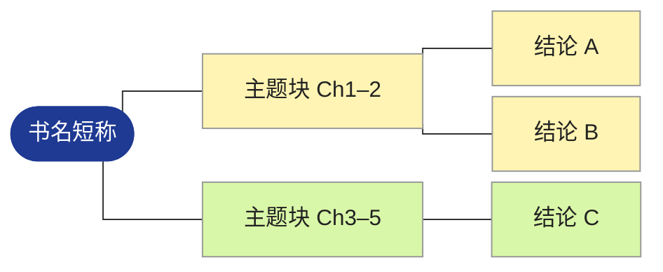
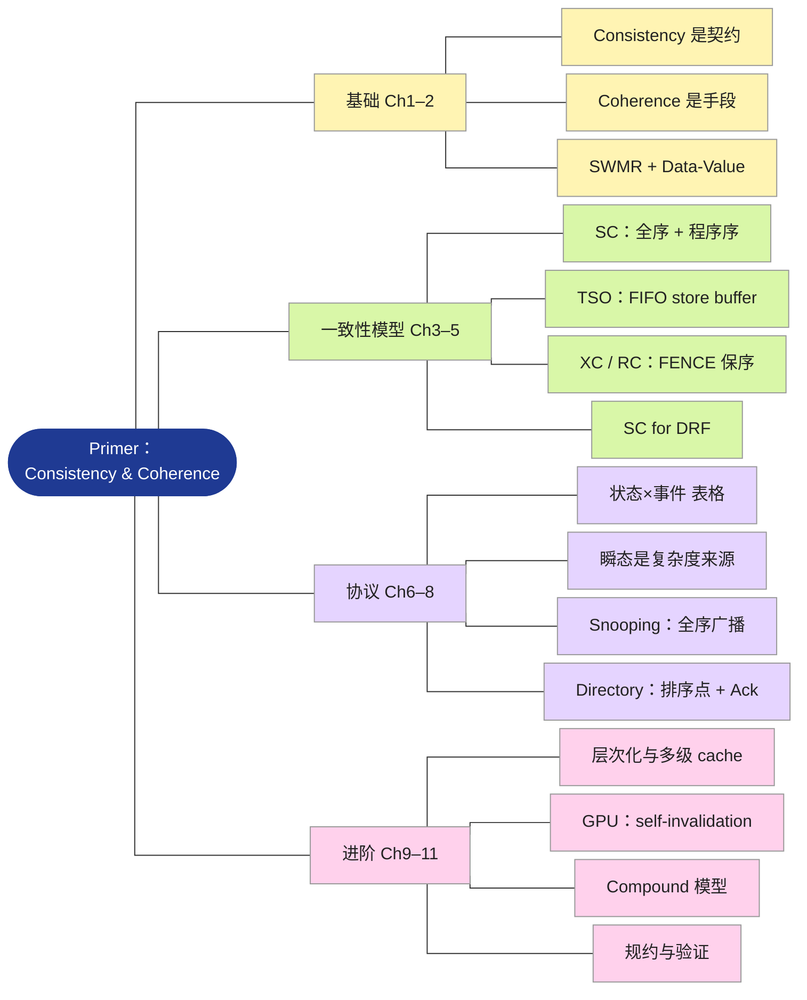

# 思维导图规则

读书笔记里的 `## 思维导图` 小节画成**左根右叶的树状图**，用 Mermaid `flowchart LR` 绘制。

为什么不用 Mermaid 的 `mindmap`：
- `mindmap` 的默认布局是力导向的发散图，节点一多就互相遮挡。
- 改动任何一个标签，整张图都会重新排布。
- 它的树状布局 `layout: tidy-tree` 需要额外注册插件包，Obsidian 内置的 Mermaid（11.13）没有带，写了也会退回发散布局。

`flowchart LR` 加直角折线是确定性的分层布局，节点不会重叠，在 Obsidian 的浅色和深色主题下都能稳定渲染。

“渲染 → 看图 → 重排”的闭环沿用 `~/.claude/skills/_shared/mermaid-rules.md` §1。该文件 §2、§3 是为数据流图写的（主流向、控制流虚线、split 节点），对树状导图不适用，本图的检查以本文件 §3 为准。

## 1. 内容结构

| 层级 | 放什么 | 数量 |
|---|---|---|
| 根 | 书名短称，必要时用 `<br/>` 断成 2 行 | 1 |
| 第 1 层 | 全书的**主题块**，标签写成 `主题名 ChX–Y` | 3–5 |
| 第 2 层 | 该块的核心结论或关键概念，一个节点只表达一个判断 | 每块 3–5 |
| 第 3 层 | 默认不用；只有某个论点不拆开就讲不清时才加 | 全图 ≤ 4 |

**节点预算：全图（含根）目标 18–26 个，硬上限 30 个。** 树状图不会重叠，预算控制的是高度：每多一个叶子节点，图就高一行。22 个节点渲染出来约为 宽 1400 × 高 2100 px（`-s 2`），在 Obsidian 里需要滚动大约一屏半。

块数和每块节点数要搭配着落进预算，常用组合：

- 3 块 × 5–6 个节点
- 4 块 × 4–5 个节点
- 5 块 × 3–4 个节点

**第 1 层怎么切：**

- 按全书的论证主线切。
- 章数 ≤ 5 且每章是一个独立主题时，可以一章一块。
- 相邻的短章节合并成一块，例如 `基础 Ch1–2`。
- 单章占全书笔记的 40% 以上时，可以按节拆成两块，写成 `主题名 Ch3.1–3.3`。
- 不要为了凑数把一章拆碎。

**标签写法：**

- 第 2 层写结论，不写话题。例如写 `TSO：FIFO store buffer`，而不是 `TSO 模型`。
- 长度：中文字数加上英文 token 数 × 2，合计 ≤ 16，渲染后要在一行内放得下。
  - 英文 token 指以空格分隔的英文词、数字、单位或缩写，每个算 1 个。
  - 例如 `32 B sector 对齐 GDDR5`：中文 2 字，英文 token 4 个，合计 2 + 4×2 = 10。
- 结论写不进长度限制时，删掉同块里次要的节点，不要把结论缩成话题。

**来源和取舍：**

- 第 2 层的每个节点都必须能在 `## 章节要点` 里找到对应内容。导图不引入正文里没有的信息。
- 为满足预算而删掉的重要主题，要在导图下方的说明段里点名，并指回 `章节要点` 的对应小节。

## 2. 语法模板



**布局参数：**

- 第一行的 `init` 不能省。
  - `nodeSpacing: 8` 收紧叶子之间的间距（默认间距下图会高出约 60%）。
  - `curve: stepBefore` 把连线画成直角折线，看起来是树，而不是流程图。
- 连线用 `---`（无箭头）。导图表达的是从属关系，不是流向。

**节点：**

- 根节点写成 `Root(["..."])`，渲染成胶囊形。
- 其他节点一律写成 `ID["文本"]`，文本放在双引号里，`()`、`[]`、`：`、`&` 就不会被解析成形状语法。
- ID 用有语义的英文，例如 `Models`、`M1`，全图不能重复。
- 文本里不要出现双引号和反引号。
- 子节点按“父节点 `---` 子节点”逐条声明，并按阅读顺序排列。Mermaid 会按声明顺序从上到下排布叶子节点。

**配色**，按第 1 层分支着色，子节点继承所在分支的颜色：

| 类名 | fill |
|---|---|
| `c1` | `#fff4b3` |
| `c2` | `#d9f7a8` |
| `c3` | `#e5d4ff` |
| `c4` | `#ffd1ec` |
| `c5` | `#cdeffd` |

- 浅色底的节点必须写 `color:#222`，否则 Obsidian 深色主题下会用浅色字，看不清。
- **不要把类名叫 `root`**。它会和 Mermaid 生成的 SVG 根元素上的 `.root` 类冲突，`color` 会被继承到全图，所有文字都变色。根节点的类用 `hub`。

## 3. 看图检查

1. 浅色、深色主题各渲染一次，两张图都要用 Read 打开看：
   ```bash
   npx -y @mermaid-js/mermaid-cli -i mm.mmd -o mm.png -b white -s 2
   npx -y @mermaid-js/mermaid-cli -i mm.mmd -o mm_dark.png -t dark -b '#1e1e1e' -s 1
   ```
2. 逐项检查：

| 检查项 | 不通过的表现 | 修法 |
|---|---|---|
| 树形清楚 | 某个叶子节点连到了错误的父节点；同一分支的叶子没有排在一起 | 检查连线声明，以及节点 ID 有没有重复 |
| 颜色正确 | 节点颜色和所属分支不一致；文字颜色异常（全白、全黑） | 检查 `:::cN` 和 classDef，类名不要用 `root` |
| 深色可读 | 深色主题图里有文字看不清 | 补上 `color:#222` |
| 文字完整 | 文字被截断，或折成多行 | 缩短标签，或删除节点 |
| 高度 | 高 / 宽 > 约 2.2（`-s 2` 下高度超过约 3000 px） | 删除次要节点，或合并第 1 层分支 |

3. 每次修改后，两张图都要重新渲染、重新检查。

## 4. 导图下方的说明段

导图下方紧跟 2–4 句自然段，内容依次是：

1. 树里画不出的跨分支依赖。例如：“第 3–5 章的模型定义是第 6–8 章协议的验收标准”。
2. 建议阅读路径。例如：`Ch1–2 → Ch3 → Ch4 → Ch5`。
3. 因预算省略的重要主题，以及它们在 `章节要点` 里的位置。没有省略就不写这一项。

## 5. 超长书籍

全书合并后第 1 层仍多于 5 块，或第 2 层省略了太多重要主题时：

- 主笔记里放一张总图，只画到第 2 层，守住节点预算。
- 在 `_detail/{书名}（详细版）.md` 里为每个第 1 层分支各画一张子图。每张子图同样遵守 §1 的预算和 §3 的检查。

## 示例（21 个节点，浅色与深色主题渲染检查通过）


