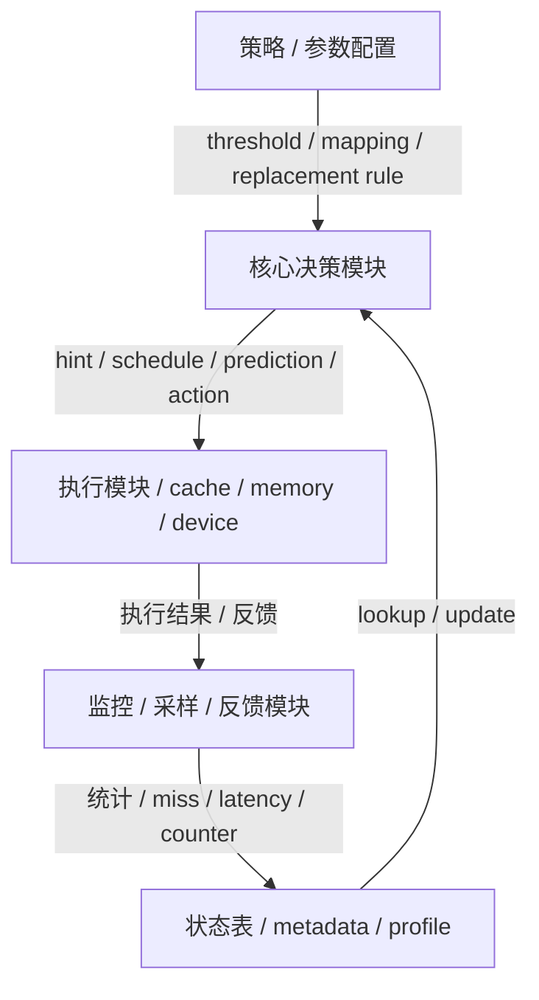
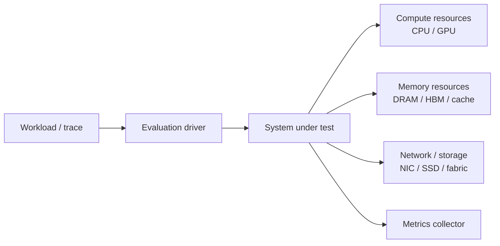

<!--
写作约束：
1. 不要单独设置“关键公式”或“关键图表”章节。
2. 公式和图表必须嵌入对应叙事位置：问题定义与瓶颈、系统设计总览、关键机制拆解、实验设置、核心结果、Overhead 与兼容性。
3. 每次出现图或公式，都要用自然段说明它在论文论证链中的位置、关键趋势或定量证据，以及它支撑的设计或结论；不要只堆素材，也不要保留模板字段名。
4. “批判性思考”合并原来的局限、隐含假设和失效场景分析。
5. 保留“关联笔记”和“速查卡片”，方便 Obsidian 中后续导航和回顾。
6. Obsidian 大纲层级只给语义结构使用，不要把普通图片写成 H3 或独立加粗标题；图片标题写进图片引用的题注/alt 文本，如 ``。
7. `## 关键机制拆解` 到下一个 `##` 之间，所有 `###` 标题必须是 `### 机制N：{机制名}`；机制内部只有按论文结构或 Agent 理解提炼出的语义子小节才可以使用 `####`，例如设计动机、机制流程、算法流程、pipeline stage、实现要点、参数权衡。普通单张 Figure / Table / 单个公式不要单独写成 `####` 小节，只能嵌入对应语义小节的自然段。
8. `相关工作定位` 中：
   - `论文` 列优先写 `[[笔记名]]`，没有内部笔记时写纯标题。
   - `外部链接` 列写 `[arXiv](...)` / `[DOI](...)` / `[Paper](...)`，没有就留空。
-->

# 论文笔记：{Title}

## 元信息

| 项目 | 内容 |
|------|------|
| 标题 | {Title} |
| 方法名 | {MethodName} |
| 作者 | {Authors} |
| 机构 | {Affiliations} |
| 发表 | {Venue}, {Year} |
| 主对比基线 | [[{baseline_paper}]] / {other_baselines} |
| 链接 | [arXiv]({arxiv_url}) / [Paper]({paper_url}) / [Code]({code_url}) |

---

## 一句话总结

> {用一句话概括这篇论文最核心的系统价值，不超过 50 字}

---

## 这篇论文为什么重要

- **核心问题**: {这篇论文真正打中的系统 bottleneck}
- **关键 insight**: {作者最值得记住的设计洞察}
- **实际价值**: {为什么这件事对部署、性能或系统设计有意义}

---

## 核心贡献

1. **{贡献1标题}**: {简要说明}
2. **{贡献2标题}**: {简要说明}
3. **{贡献3标题}**: {简要说明}

---

## 作者核心 Insights

> 记录论文中显式提出的 Observation / Insight / Takeaway，优先保留作者自己的表述逻辑。

1. **Insight 1**:
   - **现象 / 证据**: {作者用什么实验、图或数字支持这个 insight}
   - **设计启发**: {这个 insight 如何导向系统设计}
2. **Insight 2**:
   - **现象 / 证据**: {作者用什么实验、图或数字支持这个 insight}
   - **设计启发**: {这个 insight 如何导向系统设计}
3. **Insight 3**:
   - **现象 / 证据**: {作者用什么实验、图或数字支持这个 insight}
   - **设计启发**: {这个 insight 如何导向系统设计}

---

## 问题定义与瓶颈

### 目标场景

{这篇论文针对什么工作负载 / deployment 场景？}

### 系统瓶颈

{瓶颈在算力、内存、存储、网络、调度、运行时还是框架兼容性？证据是什么？}

### 现有方法的局限

{之前方法为什么不够好？主要卡在什么地方？}

### 本文的动机

{作者为什么认为自己的设计能解决这个问题？}

---

## 动机实验 / Characterization

### 特征图与数字证据

$$
...
$$

{用 2-4 句自然段解读这组 characterization 图：先说明它在动机论证链中的作用，再提炼关键趋势或定量证据，最后说明这些证据如何导向本文的设计原则。必要时在段落中点明覆盖的 workload / 场景。}

### 由实验得到的设计原则

1. {设计原则1}
2. {设计原则2}
3. {设计原则3}

---

## 系统设计总览

### 系统架构与执行流

{用自然段解释这张架构图在论文论证链中的作用：说明系统位于哪一层、边界在哪里、输入输出是什么、离线 / 在线如何分工，以及图中的关键趋势或结构关系如何支撑的设计或结论。若论文是协议或多角色交互，改用 `sequenceDiagram`。}

### 优化目标与度量口径

{先用自然段说明为什么需要这些指标：它们对应什么瓶颈、资源约束或调度目标，以及它们如何连接本文方法和实验结论。没有总览公式时，不要强行写公式，只解释度量口径。}

$$
...
$$

{用自然段解释公式建模的系统现象、主要变量的角色，以及它如何影响系统设计或评测口径。}

### 系统组成与职责

#### 模块关系图

{用自然段解释模块之间的依赖关系：核心决策模块依赖哪些状态或参数，监控 / 采样 / 反馈模块如何更新状态，执行模块如何消费 hint / metadata / schedule / prediction，反馈路径如何闭环，以及这种模块划分如何支撑论文的核心设计。若论文是硬件机制，优先标出 pipeline stage、cache / predictor / prefetcher / controller 等模块；若论文是分布式系统，优先标出 client、scheduler、worker、runtime、storage / network 等角色。}

| 组件 | 职责 | 输入输出 | 关键状态或参数 | 关联概念 |
|------|------|----------|----------------|----------|
| {组件1} | {它在系统中负责什么} | {输入 → 输出} | {队列 / cache / counter / cap / profile 等} | [[{概念1}]] |
| {组件2} | {它和其他组件如何协作} | {输入 → 输出} | {关键配置或状态} | [[{概念2}]] |

### 实现改动清单

> 只有论文确实提出实现改动时才保留本小节；纯 characterization 或没有新实现的论文可省略。

| 改动对象 | 类型 | 新增状态 / 参数 | 所在路径 | 开销或约束 |
|----------|------|-----------------|----------|------------|
| {模块1} | {硬件 SRAM/CAM/逻辑 或 software/runtime} | {容量 / 位宽 / 队列 / cap / profile} | {流水级 / runtime path / scheduler path} | {cycle / area / power / latency / 工程复杂度} |

---

## 关键机制拆解

<!-- Template check: 本节从 `## 关键机制拆解` 到下一个 `##` 之间，所有 H3 必须匹配 `### 机制N：...`。H4 只能是机制内部的语义子小节；普通单张 Figure / Table / 单个公式必须内联到自然段，不要单独做成 H4。 -->

### 机制1：{名称}

#### 设计动机

{为什么需要这个机制}

#### 机制说明

{它是怎么工作的}

$$
...
$$

{在机制说明中自然嵌入公式、Figure 或 Mermaid：用自然段把它们和机制工作流程串起来，说明它们刻画什么执行过程或系统状态，指出关键趋势 / 结构关系，并解释它们支撑的设计或结论。}

#### 实现要点

- {要点1}
- {要点2}
- {要点3}

#### 参数与权衡

{用 2-4 句自然段解读设计空间图：说明横纵轴或候选参数如何组织，指出性能、面积、复杂度或兼容性之间的关键趋势，并解释作者为什么选取最终配置。}

### 机制2：{名称}

#### 设计动机

{为什么需要这个机制}

#### 机制说明

{它是怎么工作的}

$$
...
$$

{在机制说明中自然嵌入公式、Figure 或 Mermaid：用自然段把它们和机制工作流程串起来，说明它们刻画什么执行过程或系统状态，指出关键趋势 / 结构关系，并解释它们支撑的设计或结论。}

#### 实现要点

- {要点1}
- {要点2}
- {要点3}

#### 参数与权衡

{用 2-4 句自然段解读设计空间图：说明横纵轴或候选参数如何组织，指出性能、面积、复杂度或兼容性之间的关键趋势，并解释作者为什么选取最终配置。}

---

## 实验设置

### Workload 与任务

| Workload | 领域 | 规模 / Footprint | 关键指标（MPKI / IPC / frontend-bound 等） | 来源（suite / trace） |
|----------|------|------------------|-------------------------------------------|-----------------------|
| {Workload1} | {domain} | {size / footprint} | {key metrics} | {suite / trace} |
| {Workload2} | {domain} | {size / footprint} | {key metrics} | {suite / trace} |

### Baselines

| Baseline | 类型 | 为什么重要 |
|----------|------|------------|
| {Baseline1} | {system/type} | {说明} |
| {Baseline2} | {system/type} | {说明} |

### 评测指标

| 指标 | 公式 / 定义 | 含义 | 越大 / 越小越好 |
|------|-------------|------|-----------------|
| {指标1} | {公式 / 定义} | {含义} | {越大 / 越小} |
| {指标2} | {公式 / 定义} | {含义} | {越大 / 越小} |

### 模拟器与微架构参数

{根据论文的 evaluation platform 改写这张图：只展示测试系统大概长什么样、组件如何连接、需要哪些硬件或模拟资源。优先画 client / benchmark driver / scheduler or runtime / worker / accelerator / memory / network / storage / simulator 的连接关系；不要把 CPU pipeline、cache level、BTB、ROB 等微架构细节硬塞进图里，除非它们就是论文评测对象。}

| 资源 / 组件 | 配置 | 在评测中的作用 |
|-------------|------|----------------|
| Simulator / Framework | {gem5 / ChampSim / ZSim / 真实平台 / 集群环境等} | {模拟或承载哪一层系统} |
| Compute resources | {CPU / GPU / accelerator / worker 数量与型号} | {执行模型、runtime、kernel 或仿真的角色} |
| Memory / Storage | {DRAM / HBM / KV cache / SSD / remote storage 等关键容量或带宽} | {支撑 workload 的状态、cache、数据或 checkpoint} |
| Network / Fabric | {NIC / PCIe / NVLink / Ethernet / InfiniBand 等，如适用} | {承担通信、远程访问或分布式训练 / serving 流量} |
| Scale / Run length | {节点数、batch、trace 长度、warmup、采样长度等} | {决定实验规模与可复现边界} |

{如果有定义 workload、trace、platform 或评测边界的 Figure / Table / 公式，直接嵌入对应小节的自然段中解释，不单独拆出图表小节。}

---

## 核心结果

### 主结果

{用 2-4 句自然段解读主结果：先给出主要结论，再引用最能支撑结论的定量证据，最后解释这些结果对系统设计或部署判断意味着什么。}

### 消融 / 敏感性分析

{用 2-4 句自然段解读消融或敏感性图：先说明被移除的模块或变化的参数，再提炼性能变化趋势，最后解释作者想证明的因果关系。}

### 结果解读

{把主结果和消融结果串起来解释，不要只复述数字}

---

## Overhead 与兼容性

### Overhead

{用 2-4 句自然段解读 overhead 图或表：说明新增开销来自哪些状态、逻辑、通信或运行时步骤，作者如何摊销 / 隐藏它，以及工程复杂度是否值得。}

### 兼容性

#### 适用硬件 / 平台

- **目标平台**:
- **哪些场景收益最好**:
- **哪些场景可能退化**:

#### ISA / OS / Compiler 侵入性

- **是否修改 ISA / 指令编码**:
- **是否需要 OS / runtime 支持**:
- **是否依赖 compiler / PGO / offline pass**:

#### Silicon-feasibility

- **时序闭合风险**:
- **面积 / 功耗是否可接受**:
- **与现有微架构模块的耦合点**:

---

## 批判性思考

### 优点

1. {优点1}
2. {优点2}
3. {优点3}

### 局限、假设与失效边界

1. {局限或假设1}
2. {局限或假设2}
3. {局限或假设3}

### 可能失效的场景

1. {场景1}
2. {场景2}

### 潜在改进方向

1. {改进方向1}
2. {改进方向2}

---

## 经验与可迁移启示

### 可迁移设计原则

- {这篇论文对系统设计、调度策略、硬件/软件协同或评测方法的 lesson}

### 做 related work 时值得引用的点

- {论文定位}
- {和哪些工作形成直接对比}
- {哪部分结论最值得引用}

---

## 复现

### 环境与依赖

- **代码**: {仓库地址}
- **依赖**: {关键库 / 编译器 / 驱动 / 框架}
- **硬件 / 平台**: {GPU / CPU / NIC / simulator / cluster 配置}

### 关键配置 / workload / data

- **配置**: {关键参数、集群规模、环境变量}
- **数据 / trace / workload**: {来源}
- **运行方式**: {脚本、命令、入口或实验流程}

### 复现核查表

| 项目 | 结论 | 证据或缺口 |
|---|---|---|
| 代码开源 | {是 / 否 / 未知} | {仓库、artifact 链接或缺失说明} |
| 关键配置充分 | {是 / 部分 / 否} | {必要配置是否在论文中给出} |
| baseline 公平 | {是 / 部分 / 否} | {对比对象、调参、硬件与 workload 是否一致} |
| 部署假设现实 | {是 / 部分 / 否} | {硬件、网络、trace、负载复用假设的现实性} |

### 风险与缺口

- {代码、环境、硬件依赖、负载获取、系统栈差异}

---

## 关联笔记

### 方法相关

- [[{核心技术1}]]: {关系}
- [[{核心技术2}]]: {关系}

### 理论 / 指标相关

- [[{概念1}]]: {关系}
- [[{概念2}]]: {关系}

### 系统 / 硬件相关

- [[{硬件或系统1}]]: {关系}
- [[{硬件或系统2}]]: {关系}

---

## 相关工作定位

| 论文 | 外部链接 | 关系 | 差异 |
|------|----------|------|------|
| [[{相关工作1}]] 或 {相关工作1标题} | [arXiv]({related_work1_arxiv_url}) / [DOI]({related_work1_doi_url}) / [Paper]({related_work1_paper_url}) | 基于 / 对比 / 同方向 | {差异} |
| [[{相关工作2}]] 或 {相关工作2标题} | [arXiv]({related_work2_arxiv_url}) / [DOI]({related_work2_doi_url}) / [Paper]({related_work2_paper_url}) | 基于 / 对比 / 同方向 | {差异} |

---

## 速查卡片

> [!summary] {Title}
> - **核心**: {最核心价值}
> - **方法**: {关键机制}
> - **结果**: {核心收益}
> - **适用场景**: {在哪些环境最有效}
> - **未来工作**: {可能的改进方向}
> - **引用建议**: {我会如何引用这篇论文}
---

*笔记创建时间: {timestamp}*
